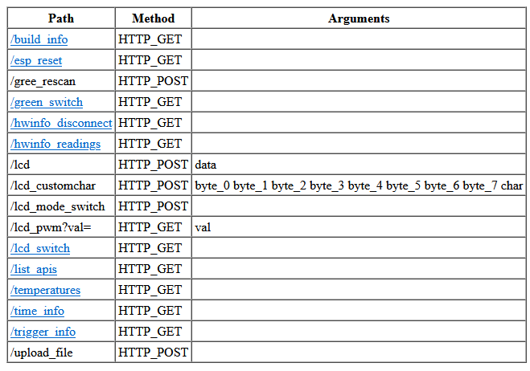

# esp8266-create-api-table

This python prebuild script generates an html table in a cpp header file for the available HTTP endpoints configured with ESP8266WebServer.


### Screenshot



### How does it work

1. Scans `*.ino` files for `ESP8266WebServer` instances
1. Scans `ESP8266WebServer` instances for `server.on(arg1, arg2, arg3)` calls
1. Scans `arg3` for HTTP `parameters`
    1. in case of `arg3` is not an inline function, scans for function in `*.ino` files
    1. else scan the inline function `[]()` for content
1. Creates an `HTML` table with the `path, request method and argument` list
1. Compresses the table with `gzip` to save some space
1. Saves the content to a cpp header file: `http_apis.h`

### How to use
1. Download the script file
1. Reference as a prebuild script in `.vscode/arduino.json`:
    ```json
    "prebuild": "python <your file directory>/make_urls.py"
    ```
1. Add to your `.ino` file the HTTP serving snippet:
    ```cpp
    server.on("/list_apis", HTTP_GET, []() {
        server.sendHeader("Content-Encoding","gzip");
        server.send_P(200, http_apis_html_content_type, http_apis_html, http_apis_html_len);
    });
    ```

### Dependencies
1. VS Code + Arduino plugin
1. python3
